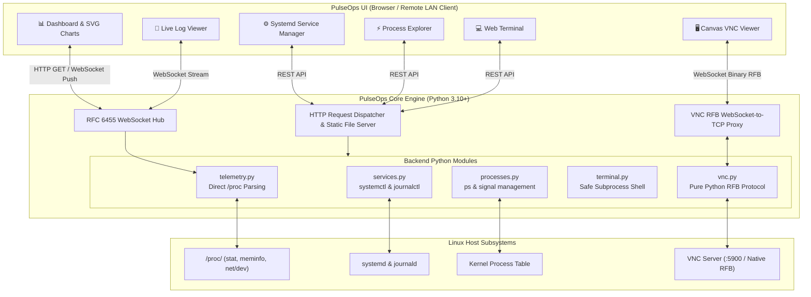

# ⚡ PulseOps (Python Edition)

<div align="center">

[](https://www.python.org/)
[](https://fastapi.tiangolo.com/)
[](https://kernel.org/)
[](LICENSE)
[](#-quick-start)

<p align="center">
  <strong>A high-performance, real-time Linux server management dashboard, systemd operations center, and remote telemetry platform.</strong>
</p>

<p align="center">
  Built with pure Python standard library asynchronous architecture, an optional FastAPI runtime, and a zero-build Obsidian glassmorphic interface.
</p>

</div>

---

## 📑 Table of Contents

- [🌟 Highlights](#-highlights)
- [🏛️ Architecture & Data Flow](#️-architecture--data-flow)
- [🚀 Quick Start](#-quick-start)
  - [Mode 1: Zero-Dependency Run (Standard Library)](#mode-1-zero-dependency-run-pure-python-standard-library)
  - [Mode 2: FastAPI / Uvicorn Run (Enhanced)](#mode-2-fastapi--uvicorn-run-enhanced)
  - [Mode 3: Systemd Daemon (Persistent Service)](#mode-3-systemd-daemon-auto-start-on-boot)
- [🌐 Local Network (LAN) & Remote Access](#-local-network-lan--remote-access)
  - [Network IP Auto-Discovery](#network-ip-auto-discovery)
  - [Firewall Setup (firewalld / ufw)](#firewall-setup)
- [🎛️ Modules & Capabilities](#️-modules--capabilities)
  - [1. Real-Time Telemetry & Health Monitoring](#1-real-time-telemetry--health-monitoring)
  - [2. Systemd Service Operations Center](#2-systemd-service-operations-center)
  - [3. Interactive Process Explorer](#3-interactive-process-explorer)
  - [4. Live WebSocket Log Streaming](#4-live-websocket-log-streaming)
  - [5. Secure Web Terminal](#5-secure-web-terminal)
  - [6. Embedded HTML5 VNC / RFB Desktop](#6-embedded-html5-vnc--rfb-desktop)
- [🔌 API & WebSocket Protocol Reference](#-api--websocket-protocol-reference)
  - [REST Endpoints](#rest-endpoints)
  - [WebSocket Channels](#websocket-channels)
- [⚙️ Configuration & Environment Variables](#️-configuration--environment-variables)
- [🛡️ Security & Hardening Guidelines](#️-security--hardening-guidelines)
- [📁 Project Structure](#-project-structure)
- [🤝 Contributing](#-contributing)
- [📄 License](#-license)

---

## 🌟 Highlights

* 🚀 **Zero External Dependencies Required**: Run the entire web server, REST API, WebSocket streams, and static assets out of the box using **only standard Python 3.10+ libraries** (`asyncio`, `socket`, `struct`, `hashlib`, `json`).
* ⚡ **Dual Execution Engine**:
  * **Standalone AsyncIO Engine** (`server.py`): Minimal footprint, native non-blocking HTTP 1.1 + RFC 6455 WebSocket implementation.
  * **FastAPI + Uvicorn Engine** (`fastapi_app.py`): Production-grade ASGI framework with automatic OpenAPI docs and optional `psutil` acceleration.
* 📊 **Kernel & `/proc` Telemetry**: Direct parsing of `/proc/stat`, `/proc/meminfo`, `/proc/net/dev`, `/proc/uptime`, and `/proc/cpuinfo` for accurate system readings with near-zero overhead.
* ⚙️ **Comprehensive Systemd Control**: Real-time service monitoring, unit lifecycle management (`start`, `stop`, `restart`, `enable`, `disable`), and `journalctl` log inspection.
* ⚡ **Interactive Process Manager**: Live CPU/Memory sorted process tree with guarded `SIGTERM` and `SIGKILL` termination controls.
* 📜 **Real-Time Log Stream**: Continuous WebSocket stream with dynamic log-level filters (`INFO`, `DEBUG`, `WARN`, `ERROR`), source filters, and text search.
* 💻 **Safe Web Terminal**: In-browser CLI execution supporting `sudo` password prompts and dangerous command blacklisting.
* 🖥️ **Embedded VNC / RFB Desktop**: Includes a native pure-Python RFB 3.8 protocol server and WebSocket-to-TCP RFB proxy for embedded remote desktop viewing directly in the browser canvas.
* 💎 **Obsidian Glassmorphic UI**: Ultra-responsive vanilla HTML5, CSS3, and JavaScript frontend with dark glassmorphism styling—no Node.js, webpack, or npm builds needed.

---

## 🏛️ Architecture & Data Flow



---

## 🚀 Quick Start

### Mode 1: Zero-Dependency Run (Pure Python Standard Library)

You can run PulseOps instantly without installing any third-party packages:

```bash
# Clone the repository
git clone https://github.com/Sword360/pulseops-Python-Based.git
cd pulseops-Python-Based

# Start the standalone server (Default: port 3500)
python3 server.py
```

On launch, the server binds to `0.0.0.0:3500` and displays your accessible URLs:
```text
⚡ PulseOps Python Server running:
   ➜ Local:   http://localhost:3500
   ➜ Network: http://192.168.1.100:3500
```

---

### Mode 2: FastAPI / Uvicorn Run (Enhanced)

For an ASGI production deployment with automated API documentation:

```bash
# Optional: create and activate a virtual environment
python3 -m venv venv
source venv/bin/activate

# Install requirements
pip install -r requirements.txt

# Run via Uvicorn (binds to all network interfaces)
uvicorn fastapi_app:app --host 0.0.0.0 --port 3500
```

* **Web Dashboard**: `http://localhost:3500/`
* **Interactive Swagger API Docs**: `http://localhost:3500/docs`
* **ReDoc Documentation**: `http://localhost:3500/redoc`

---

### Mode 3: Systemd Daemon (Auto-Start on Boot)

To run PulseOps as a persistent background Linux daemon:

1. Create a systemd service file:
   ```bash
   sudo nano /etc/systemd/system/pulseops.service
   ```

2. Paste the following configuration (adjust `WorkingDirectory` and paths as needed):
   ```ini
   [Unit]
   Description=PulseOps Linux Server Telemetry & Operations Dashboard
   After=network.target

   [Service]
   Type=simple
   User=root
   WorkingDirectory=/root/Project/pulseops-Python-Based
   ExecStart=/usr/bin/python3 /root/Project/pulseops-Python-Based/server.py
   Restart=always
   RestartSec=5
   Environment=PORT=3500
   Environment=HOST=0.0.0.0

   [Install]
   WantedBy=multi-user.target
   ```

3. Enable and start the service:
   ```bash
   sudo systemctl daemon-reload
   sudo systemctl enable --now pulseops.service
   ```

4. Verify service status:
   ```bash
   sudo systemctl status pulseops.service
   ```

---

## 🌐 Local Network (LAN) & Remote Access

PulseOps binds to `0.0.0.0` by default, allowing connections from other PCs, laptops, tablets, and phones on the same network.

### Network IP Auto-Discovery

When you start `server.py`, the console automatically detects and displays all network interface addresses:

```text
⚡ PulseOps Python Server running:
   ➜ Local:   http://localhost:3500
   ➜ Network: http://192.168.160.135:3500
   ➜ Network: http://192.168.100.10:3500
```

Simply navigate to `http://<SERVER_IP>:3500` from any browser on the same LAN or VPN.

### Firewall Setup

If other systems cannot connect, open TCP port `3500` in your firewall:

#### For RHEL / CentOS / Fedora / AlmaLinux / Rocky Linux (`firewalld`):
```bash
sudo firewall-cmd --add-port=3500/tcp --permanent
sudo firewall-cmd --reload
```

#### For Ubuntu / Debian (`ufw`):
```bash
sudo ufw allow 3500/tcp
sudo ufw reload
```

#### For Raw `iptables`:
```bash
sudo iptables -A INPUT -p tcp --dport 3500 -j ACCEPT
```

---

## 🎛️ Modules & Capabilities

### 1. Real-Time Telemetry & Health Monitoring
* **CPU Load**: Calculates total vs. idle ticks directly from `/proc/stat`.
* **Memory & Swap**: Parses `/proc/meminfo` for active, cached, buffer, total, and swap usage metrics.
* **Disk Filesystem**: Queries filesystem size, consumed storage, and available capacity.
* **Network Throughput**: Computes instantaneous RX/TX transfer rates (KB/s, MB/s) and lifetime byte counters from `/proc/net/dev`.
* **Host Metadata**: Automatically retrieves OS distribution (`/etc/os-release`), kernel version, hardware architecture, CPU model, core count, and system uptime (`/proc/uptime`).

### 2. Systemd Service Operations Center
* **Live Unit Listing**: Reads loaded systemd units via `systemctl list-units`.
* **State Badges**: Color-coded indicators for `active (running)`, `inactive (dead)`, and `failed`.
* **Lifecycle Actions**: Send `start`, `stop`, `restart`, `reload`, `enable`, and `disable` commands.
* **Journal Inspection**: Read the latest systemd journal logs (`journalctl -u <service>`) directly in a modal overlay.

### 3. Interactive Process Explorer
* **Real-Time Process Table**: Displays PID, User, CPU%, Mem%, VSZ, RSS, Status, and Command line args.
* **Live Search & Sort**: Filter processes by name, PID, or user; sort by CPU or memory usage.
* **Process Termination**: Safely dispatch `SIGTERM` (15) for graceful exit or `SIGKILL` (9) for immediate termination.

### 4. Live WebSocket Log Streaming
* **Real-Time Push**: Pushes system logs and events directly over WebSocket.
* **Filtering & Triage**:
  * Severity filters: `INFO`, `WARN`, `ERROR`, `DEBUG`.
  * Source filters: `kernel`, `systemd-journald`, `sshd`, `nginx`, `dockerd`, `cron`.
* **Controls**: Live search, log clearing, pause/resume streaming, and auto-scroll locking.

### 5. Secure Web Terminal
* **In-Browser Shell**: Execute administration commands safely from the web console.
* **Sudo Integration**: Supports elevated execution with secure credential masking.
* **Destructive Command Guard**: Automatically intercepts and blocks dangerous commands such as:
  * `rm -rf /`
  * `mkfs`
  * `dd if=/dev/zero`
  * Fork bombs (`:(){ :|:& };:`)

### 6. Embedded HTML5 VNC / RFB Desktop
* **Pure Python RFB Server**: Implements RFB 3.8 handshaking, security negotiation (None/VNC auth), ServerInit, and raw framebuffer updates.
* **WebSocket Proxy Bridge**: Bi-directionally bridges browser WebSocket traffic to remote or local RFB TCP daemons (`localhost:5900` to `5905`).
* **HTML5 Canvas Rendering**: Interactive canvas viewer transmitting pointer coordinates, mouse clicks, and keyboard strokes.
* **Daemon Auto-Detection**: Scans for installed VNC daemons (`x11vnc`, `tigervnc`, `wayvnc`) and open VNC ports.

---

## 🔌 API & WebSocket Protocol Reference

### REST Endpoints

| Method | Endpoint | Description | Request Body / Query |
| :--- | :--- | :--- | :--- |
| `GET` | `/api/services` | Retrieve list of all systemd services and states | None |
| `POST` | `/api/services/action` | Trigger action on a systemd service | `{"serviceName": "nginx.service", "action": "restart"}` |
| `GET` | `/api/services/{name}/logs` | Fetch recent journald logs for a service | None |
| `GET` | `/api/processes` | List active processes sorted by CPU usage | None |
| `POST` | `/api/processes/kill` | Terminate process with a signal | `{"pid": 1234, "signal": "15"}` |
| `POST` | `/api/terminal/exec` | Execute shell command with optional sudo | `{"command": "uname -a", "sudoPassword": "..."}` |
| `GET` | `/api/vnc/status` | Query host VNC daemons and open ports | `?host=127.0.0.1` |
| `POST` | `/api/vnc/launch` | Start native or host VNC server | `{"display": ":0", "port": 5900, "useNative": true}` |

### WebSocket Channels

#### 1. Telemetry & Log Stream (`/`)
* **Endpoint**: `ws://<HOST>:<PORT>/` (or `wss://` over SSL/TLS)
* **Message Types**:
  * `telemetry`: Periodic payload with CPU, RAM, Disk, Network, and System specs.
  * `logStream`: Continuous event log entries with timestamps, severity levels, and sources.

```json
{
  "type": "telemetry",
  "data": {
    "cpu": 12.4,
    "memory": {
      "total": 16777216000,
      "used": 4294967296,
      "free": 12482248704,
      "usagePercent": 25.6
    },
    "network": { "rxSec": 1048576, "txSec": 524288 },
    "system": { "hostname": "prod-server-01", "uptime": 86400 }
  }
}
```

#### 2. VNC RFB Proxy (`/api/vnc/ws`)
* **Endpoint**: `ws://<HOST>:<PORT>/api/vnc/ws?host=127.0.0.1&port=5900`
* **Protocol**: Binary RFB (Remote Framebuffer) protocol data bridged to TCP.

---

## ⚙️ Configuration & Environment Variables

PulseOps can be configured using standard environment variables:

| Variable | Default | Description |
| :--- | :--- | :--- |
| `PORT` | `3500` | Port for the HTTP and WebSocket server |
| `HOST` | `0.0.0.0` | Network interface IP to bind to (`0.0.0.0` listens on all interfaces) |
| `DISPLAY` | `:0` | Target X11/Wayland display for VNC desktop sessions |

Example:
```bash
HOST=192.168.1.50 PORT=8080 python3 server.py
```

---

## 🛡️ Security & Hardening Guidelines

> [!WARNING]
> PulseOps provides administrative access to your Linux host (service control, process termination, and shell execution). When exposing it over an untrusted network, apply the following security measures:

1. **Reverse Proxy & SSL/TLS**: Place PulseOps behind **Nginx**, **Caddy**, or **Traefik** with HTTPS and secure WebSockets (`wss://`).
2. **Authentication**: Use Basic Auth, Authelia, or OAuth via reverse proxy.
3. **Firewall Restriction**: Restrict access to trusted subnets or a VPN (e.g. WireGuard, Tailscale) instead of exposing port 3500 directly to the public internet:
   ```bash
   sudo ufw allow from 192.168.1.0/24 to any port 3500 proto tcp
   ```
4. **Least Privilege**: Run PulseOps with a dedicated non-root user and grant fine-grained `sudoers` permissions for specific commands if full root is not required.

---

## 📁 Project Structure

```text
pulseops-Python-Based/
├── server.py             # Pure Python asyncio HTTP & RFC 6455 WebSocket server
├── fastapi_app.py        # Alternative FastAPI / ASGI implementation with OpenAPI
├── telemetry.py          # /proc filesystem metrics engine (CPU, RAM, Disk, Net)
├── services.py           # Systemd unit manager and journalctl log parser
├── processes.py          # Process explorer and POSIX signal dispatcher
├── terminal.py           # Web terminal subprocess runner with sudo handling
├── vnc.py                # Pure Python embedded RFB 3.8 VNC server & TCP proxy
├── requirements.txt      # Optional dependencies (FastAPI, Uvicorn, psutil)
├── REQUIREMENTS.md       # Technical architecture specification
├── README.md             # Project documentation and guide
└── public/               # Obsidian Glassmorphic Web Dashboard
    ├── index.html        # Main dashboard interface
    ├── css/
    │   └── style.css     # Glassmorphic dark theme CSS design system
    └── js/
        ├── app.js        # Core app initialization and WebSocket telemetry client
        ├── charts.js     # Real-time SVG performance charts
        ├── services.js   # Systemd service manager UI logic
        ├── processes.js  # Process explorer and kill dialog logic
        ├── logs.js       # Live log streaming and filter engine
        └── vnc.js        # HTML5 Canvas RFB client and input handling
```

---

## 🤝 Contributing

Contributions, feature requests, and bug reports are welcome!

1. Fork the repository
2. Create your feature branch (`git checkout -b feature/AmazingFeature`)
3. Commit your changes (`git commit -m 'Add some AmazingFeature'`)
4. Push to the branch (`git push origin feature/AmazingFeature`)
5. Open a Pull Request

---

## 📄 License

This project is licensed under the **MIT License** — see the [LICENSE](LICENSE) file for details.

<div align="center">
  <sub>Built with ⚡ and Python Asyncio. Designed for Linux administrators and DevOps engineers.</sub>
</div>
