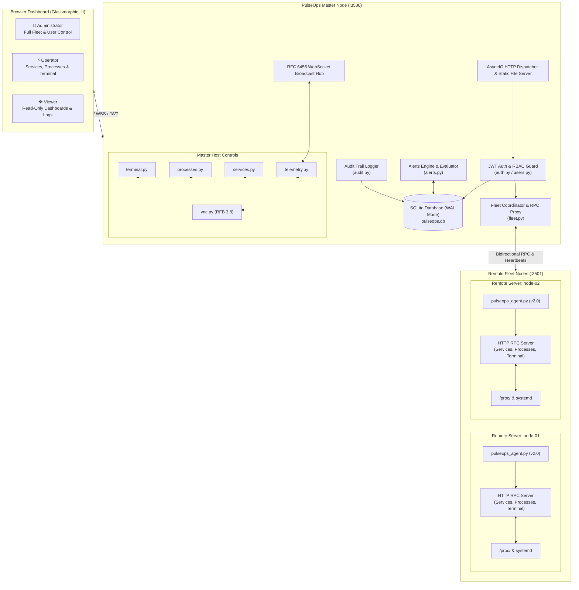

# ⚡ PulseOps Enterprise — Real-Time Linux Infrastructure Management

<div align="center">

[](https://www.python.org/)
[](https://fastapi.tiangolo.com/)
[](https://jwt.io/)
[](https://kernel.org/)
[](LICENSE)

<p align="center">
  <strong>An enterprise-grade, real-time Linux fleet monitoring dashboard, remote systemd operations center, process manager, and web terminal platform.</strong>
</p>

<p align="center">
  Engineered with high-performance asynchronous Python, an optional ASGI runtime, multi-node agent RPC telemetry, 3-tier RBAC security, and an ultra-responsive dark glassmorphic dashboard with zero frontend build dependencies.
</p>

</div>

---

## 📑 Table of Contents

- [🌟 Highlights & Key Features](#-highlights--key-features)
- [🏛️ System Architecture](#️-system-architecture)
- [👥 Role-Based Access Control (RBAC)](#-role-based-access-control-rbac)
- [🚀 Quick Start Guide](#-quick-start-guide)
  - [1. Running the Master Server](#1-running-the-master-server)
  - [2. Default Login Credentials](#2-default-login-credentials)
  - [3. Running as a Persistent Systemd Service](#3-running-as-a-persistent-systemd-service)
- [🌐 Multi-Node Fleet Management](#-multi-node-fleet-management)
  - [Auto-Agent Installation (One-Liner)](#auto-agent-installation-one-liner)
  - [Remote Agent Upgrades](#remote-agent-upgrades)
  - [Manual Agent Registration](#manual-agent-registration)
- [🎛️ Core Capabilities & Modules](#️-core-capabilities--modules)
  - [1. Real-Time Telemetry & Smooth Canvas Charts](#1-real-time-telemetry--smooth-canvas-charts)
  - [2. Systemd Operations & Live Journalctl](#2-systemd-operations--live-journalctl)
  - [3. Process Explorer & Signal Management](#3-process-explorer--signal-management)
  - [4. Multi-Host Web Terminal](#4-multi-host-web-terminal)
  - [5. Embedded HTML5 VNC / RFB Desktop](#5-embedded-html5-vnc--rfb-desktop)
  - [6. Alert Rules Engine & Notifications](#6-alert-rules-engine--notifications)
  - [7. Compliance Audit Log & System Settings](#7-compliance-audit-log--system-settings)
- [🔌 API Reference](#-api-reference)
- [⚙️ Configuration & Environment Variables](#️-configuration--environment-variables)
- [🛡️ Security & Hardening Guidelines](#️-security--hardening-guidelines)
- [📁 Project Structure](#-project-structure)
- [🤝 Contributing](#-contributing)
- [📄 License](#-license)

---

## 🌟 Highlights & Key Features

* 🚀 **Zero External Frontend Build Tools**: Built with pure vanilla HTML5, CSS3, and JavaScript—no Node.js, Webpack, Vite, or npm compilation pipelines required.
* ⚡ **Dual Backend Engine**:
  * **Standalone AsyncIO Engine** (`server.py`): Zero external framework dependencies. Native non-blocking HTTP 1.1 + RFC 6455 WebSocket streaming.
  * **FastAPI + Uvicorn Runtime** (`fastapi_app.py`): Full ASGI integration with interactive Swagger UI (`/docs`) and ReDoc.
* 🛰️ **Distributed Multi-Node Fleet Management**: Seamlessly monitor dozens of remote Linux servers from a single master dashboard with dedicated telemetry, service management, process control, and terminal access per node.
* 🔒 **Enterprise RBAC & Security**:
  * Strict 3-tier Role-Based Access Control: **Admin**, **Operator**, and **Viewer**.
  * Cryptographic JWT access & refresh tokens with auto-renewal and server-side blacklisting on logout.
  * Two-Factor Authentication (TOTP 2FA) compatible with Google Authenticator, Authy, and 1Password.
  * Brute-force rate limiting and automated account lockout protection.
* 📊 **Kernel `/proc` Telemetry**: Direct zero-overhead parsing of `/proc/stat`, `/proc/meminfo`, `/proc/net/dev`, `/proc/uptime`, and `/proc/diskstats`.
* ⚙️ **Remote Systemd Management**: Inspect unit statuses, start/stop/restart/reload services, and tail live `journalctl` logs across master and agent nodes.
* ⚡ **Live Process Explorer**: Filter and inspect processes with real-time CPU/memory sorting and protected POSIX signal dispatching (`SIGTERM`, `SIGKILL`).
* 💻 **Browser-Based SSH/Web Terminal**: Execute shell commands, configure saved commands, and prompt for `sudo` elevation with destructive command safeguards.
* 🖥️ **Embedded HTML5 VNC / RFB Remote Desktop**: Integrated pure-Python RFB 3.8 protocol server and WebSocket-to-TCP RFB proxy for embedded graphical display control.
* 🚨 **Automated Alerting Engine**: Define threshold-based alert rules for CPU, RAM, Disk, and node offline events with instant UI bell notifications.

---

## 🏛️ System Architecture



---

## 👥 Role-Based Access Control (RBAC)

PulseOps enforces strict permissions across both the UI and backend REST API:

| Feature / Operation | 👑 Admin | ⚡ Operator | 👁️ Viewer | API Enforcement |
| :--- | :---: | :---: | :---: | :--- |
| **View Dashboards, Charts & Telemetry** | ✅ | ✅ | ✅ | Open / Read authenticated |
| **View Systemd Services & Journalctl Logs** | ✅ | ✅ | ✅ | `GET /api/services` |
| **View Process Explorer List** | ✅ | ✅ | ✅ | `GET /api/processes` |
| **View Active Alerts & History** | ✅ | ✅ | ✅ | `GET /api/alerts/*` |
| **Systemd Service Control (Start/Stop/Restart)** | ✅ | ✅ | ❌ | `POST /api/services/action` (403 for Viewers) |
| **Terminate Processes (SIGTERM / SIGKILL)** | ✅ | ✅ | ❌ | `POST /api/processes/kill` (403 for Viewers) |
| **Web Terminal Command Execution** | ✅ | ✅ | ❌ | `POST /api/terminal/exec` (403 for Viewers) |
| **Launch Remote VNC Desktop Sessions** | ✅ | ✅ | ❌ | `POST /api/vnc/launch` (403 for Viewers) |
| **Host Quick Actions (Reboot, Free RAM)** | ✅ | ✅ | ❌ | `POST /api/terminal/exec` (403 for Viewers) |
| **Register & Auto-Install Fleet Servers** | ✅ | ❌ | ❌ | `POST /api/fleet/servers` (Admin only) |
| **Edit Server Metadata & Tags** | ✅ | ❌ | ❌ | `PUT /api/fleet/servers/{id}` (Admin only) |
| **Remove Server from Fleet** | ✅ | ❌ | ❌ | `DELETE /api/fleet/servers/{id}` (Admin only) |
| **User Account Management (Create/Edit/Lock)** | ✅ | ❌ | ❌ | `/api/admin/users/*` (Admin only) |
| **Alert Rules Configuration** | ✅ | ❌ | ❌ | `POST/DELETE /api/alerts/rules` (Admin only) |
| **Audit Logs Inspection** | ✅ | ❌ | ❌ | `GET /api/admin/audit` (Admin only) |
| **System Settings Configuration** | ✅ | ❌ | ❌ | `PUT /api/admin/settings` (Admin only) |

---

## 🚀 Quick Start Guide

### 1. Running the Master Server

PulseOps can run immediately using Python 3.10+ without compiling anything:

```bash
# 1. Clone the repository
git clone https://github.com/Sword360/pulseops-Python-Based.git
cd pulseops-Python-Based

# 2. Start the master server
python3 server.py
```

On startup, the server automatically initializes `pulseops.db` in SQLite WAL mode and binds to `0.0.0.0:3500`:

```text
⚡ PulseOps Enterprise Server running:
   ➜ Local:   http://localhost:3500
   ➜ Network: http://192.168.100.10:3500
```

---

### 2. Default Login Credentials

On first run, the database is seeded with a default administrator account:

* **URL**: `http://<MASTER_IP>:3500/login`
* **Email**: `admin@pulseops.local`
* **Password**: `Admin@PulseOps2026!`

> [!IMPORTANT]
> Immediately change your password after initial login under **User Management** (`#users`) or via your profile dropdown menu.

---

### 3. Running as a Persistent Systemd Service

To ensure 24/7 uptime and automated reboot recovery on your master node:

1. Create the systemd unit file:
   ```bash
   sudo nano /etc/systemd/system/pulseops.service
   ```

2. Add the following unit configuration:
   ```ini
   [Unit]
   Description=PulseOps Linux Server Telemetry & Operations Dashboard
   After=network.target

   [Service]
   Type=simple
   User=root
   WorkingDirectory=/root/Project/pulseops-Python-Based
   ExecStart=/usr/bin/python3 /root/Project/pulseops-Python-Based/server.py
   Restart=always
   RestartSec=5
   Environment=PORT=3500
   Environment=HOST=0.0.0.0

   [Install]
   WantedBy=multi-user.target
   ```

3. Enable and start the service:
   ```bash
   sudo systemctl daemon-reload
   sudo systemctl enable --now pulseops.service
   sudo systemctl status pulseops.service
   ```

---

## 🌐 Multi-Node Fleet Management

PulseOps enables centralized multi-server management through lightweight agent nodes (`pulseops-agent`).

### Auto-Agent Installation (One-Liner)

1. Open the PulseOps web dashboard as an Administrator.
2. Navigate to **Fleet Overview** and click **`+ Add Server`** (or select **Agent Auto-Install**).
3. Copy the generated one-line command and execute it on the target remote server as root:

```bash
curl -sSL http://<MASTER_IP>:3500/api/fleet/agent-install.sh | sudo bash
```

The installer automatically:
- Detects the package manager (`apt-get`, `dnf`, `yum`, `pacman`).
- Installs Python 3 and creates an isolated virtual environment (`/opt/pulseops-agent/venv`) handling PEP 668 restrictions.
- Installs the v2 RPC agent daemon.
- Configures and starts `pulseops-agent.service` pointing to the master node.

### Remote Agent Upgrades

If a remote node is running an older agent version, upgrade it instantly to unlock remote systemd and process management:

```bash
curl -sSL http://<MASTER_IP>:3500/api/fleet/agent-update.sh | sudo bash
```

### Manual Agent Registration

For air-gapped or pre-provisioned environments:
1. Generate an invite token in **Fleet** > **Manual Registration**.
2. Run `pulseops_agent.py` on the target machine:
   ```bash
   python3 pulseops_agent.py --master http://<MASTER_IP>:3500 --token <INVITE_TOKEN> --port 3501
   ```

---

## 🎛️ Core Capabilities & Modules

### 1. Real-Time Telemetry & Smooth Canvas Charts
* **Zero Overhead**: Direct `/proc` filesystem metrics parser (`CPU`, `Memory`, `Disk`, `Network RX/TX`, `Load Averages`).
* **Hardware Information**: Kernel version, architecture, CPU model, core topology, and active storage volume mounts.
* **Smooth Canvas Engine**: Custom HTML5 Canvas rendering engine with Bezier curve smoothing, dynamic Y-axis scaling, and dual network traffic visualization.

### 2. Systemd Operations & Live Journalctl
* **Unit Lifecycle**: Start, stop, restart, enable, or disable any loaded systemd unit.
* **Instant Triage**: View color-coded states (`active`, `inactive`, `failed`).
* **Live Logs**: Inspect the latest `journalctl` service logs directly in a modal console.

### 3. Process Explorer & Signal Management
* **Resource Sorting**: Live table sorting by CPU%, Memory% (RSS), and PID.
* **Signal Dispatch**: Send graceful `SIGTERM` (15) or immediate `SIGKILL` (9) signals with role confirmation safeguards.

### 4. Multi-Host Web Terminal
* **Target Node Switching**: Execute terminal commands directly on Master or transparently on any remote fleet node.
* **Sudo Elevation**: Prompts and handles elevated `sudo` commands securely without plaintext storage.
* **Safety Filter**: Protects against accidental execution of destructive patterns (`rm -rf /`, `mkfs`, fork bombs).

### 5. Embedded HTML5 VNC / RFB Desktop
* **Pure Python RFB Server**: Implements RFB 3.8 protocol handshaking and frame encoding.
* **WebSocket Proxy**: Bi-directionally bridges browser canvas input and video frames to X11/Wayland sessions.

### 6. Alert Rules Engine & Notifications
* Define automated rules for CPU%, Memory%, Disk%, and Agent heartbeats (`> 85% for 2 consecutive intervals`).
* Real-time notifications pop up in the top navigation bell with event severity tags (`WARNING`, `CRITICAL`).

### 7. Compliance Audit Log & System Settings
* **Audit Trail**: Every login attempt, terminal command, service modification, process kill, and fleet mutation is logged with timestamp, user ID, IP address, and status.
* **Central Settings**: Configure global retention limits, session timeout hours, SMTP alerts, and branding.

---

## 🔌 API Reference

### Authentication & User Management
* `POST /api/auth/login` — Authenticate credentials with optional TOTP 2FA.
* `POST /api/auth/refresh` — Refresh access token using refresh token.
* `POST /api/auth/logout` — Invalidate session and blacklist token.
* `GET  /api/auth/me` — Fetch current user profile and role permissions.
* `GET  /api/admin/users` — List all registered users (Admin only).
* `POST /api/admin/users` — Create new user account (Admin only).
* `PUT  /api/admin/users/{id}` — Update user role, status, or password (Admin only).
* `DELETE /api/admin/users/{id}` — Delete user account (Admin only).

### Fleet Operations
* `GET    /api/fleet/servers` — List all monitored servers and current telemetry snapshots.
* `POST   /api/fleet/servers` — Manually register a new server node (Admin only).
* `PUT    /api/fleet/servers/{id}` — Update server display name, tags, and notes (Admin only).
* `DELETE /api/fleet/servers/{id}` — Remove a server from the fleet (Admin only).
* `GET    /api/fleet/servers/{id}/metrics` — Fetch historical telemetry timeseries.
* `POST   /api/fleet/register` — Agent registration endpoint using invite token.
* `POST   /api/fleet/heartbeat` — Periodic agent telemetry submission.
* `GET    /api/fleet/agent-install.sh` — Dynamic agent installer script.
* `GET    /api/fleet/agent-update.sh` — Dynamic agent updater script.

### System & Control Operations
* `GET  /api/services` — List systemd units (`?server_id=...`).
* `POST /api/services/action` — Start/stop/restart unit (`admin`, `operator`).
* `GET  /api/services/{name}/logs` — Fetch journalctl logs.
* `GET  /api/processes` — List running processes (`?server_id=...`).
* `POST /api/processes/kill` — Dispatch kill signal (`admin`, `operator`).
* `POST /api/terminal/exec` — Execute shell command on target node (`admin`, `operator`).
* `GET  /api/vnc/status` — Query VNC availability.
* `POST /api/vnc/launch` — Launch VNC desktop session (`admin`, `operator`).

### Alerts & Administration
* `GET    /api/alerts/rules` — List active alert evaluation rules.
* `POST   /api/alerts/rules` — Create a new alert rule (Admin only).
* `DELETE /api/alerts/rules/{id}` — Delete an alert rule (Admin only).
* `GET    /api/alerts/active` — List currently firing alerts.
* `GET    /api/admin/audit` — Query audit log events with filter parameters (Admin only).
* `GET    /api/admin/settings` — Read system configuration settings (Admin only).
* `PUT    /api/admin/settings` — Update system configuration settings (Admin only).

---

## ⚙️ Configuration & Environment Variables

PulseOps can be configured via environment variables or the `.env` file:

| Variable | Default | Description |
| :--- | :--- | :--- |
| `PORT` | `3500` | Port for the HTTP and WebSocket server |
| `HOST` | `0.0.0.0` | Bind IP interface (`0.0.0.0` listens across all network interfaces) |
| `DB_PATH` | `./pulseops.db` | File path for the SQLite database |
| `SECRET_KEY` | *(Auto-generated)* | 256-bit cryptographic secret for signing JWT access tokens |
| `REFRESH_SECRET_KEY` | *(Auto-generated)* | Secret key for signing JWT refresh tokens |
| `SESSION_TIMEOUT_HOURS` | `24` | Default expiration window for user authentication sessions |

---

## 🛡️ Security & Hardening Guidelines

1. **Production Reverse Proxy & TLS**: Always terminate SSL/TLS via **Nginx**, **Caddy**, or an enterprise load balancer when exposing PulseOps outside a trusted LAN.
2. **Dedicated User Execution**: Run `server.py` under an unprivileged user (e.g. `pulseops`) and configure targeted `sudoers.d/pulseops` permissions for specific commands if complete root access is unnecessary.
3. **Firewall Isolation**: Restrict port `3500` and agent port `3501` to your management subnet or VPN (e.g. WireGuard, Tailscale):
   ```bash
   # firewalld (RHEL/Rocky/CentOS)
   sudo firewall-cmd --permanent --add-rich-rule='rule family="ipv4" source address="192.168.100.0/24" port port="3500" protocol="tcp" accept'
   sudo firewall-cmd --reload

   # ufw (Debian/Ubuntu)
   sudo ufw allow from 192.168.100.0/24 to any port 3500 proto tcp
   ```

---

## 📁 Project Structure

```text
pulseops-Python-Based/
├── server.py             # High-performance async HTTP & WebSocket server (master runtime)
├── fastapi_app.py        # Alternative ASGI FastAPI implementation with OpenAPI
├── pulseops_agent.py     # Remote agent daemon (telemetry, service & process RPC)
├── telemetry.py          # /proc filesystem metrics engine (CPU, RAM, Disk, Net)
├── services.py           # Systemd unit manager and journalctl log parser
├── processes.py          # Process explorer and POSIX signal dispatcher
├── terminal.py           # Safe Web terminal subprocess runner with sudo handling
├── vnc.py                # Pure Python embedded RFB 3.8 VNC server & TCP proxy
├── fleet.py              # Multi-node server coordinator and remote RPC client
├── auth.py               # Enterprise JWT, bcrypt, TOTP 2FA, and RBAC authorization
├── users.py              # User authentication, credential storage, and profile management
├── database.py           # Async SQLite database layer with automated migrations
├── alerts.py             # Metric threshold rule evaluator and notification dispatcher
├── audit.py              # Immutable compliance audit trail logging system
├── requirements.txt      # Python dependencies (PyJWT, passlib, aiosqlite, cryptography)
├── README.md             # Comprehensive project documentation
└── public/               # Zero-build Glassmorphic Web Dashboard
    ├── index.html        # Main enterprise dashboard interface
    ├── login.html        # Glassmorphic login page with 2FA TOTP modal
    ├── css/
    │   ├── style.css     # Dark glassmorphism design system & RBAC visibility rules
    │   └── login.css     # Animated login page stylesheet
    └── js/
        ├── app.js        # Dashboard state management and real-time WebSocket client
        ├── auth.js       # Global JWT management, token auto-refresh, and auth guard
        ├── charts.js     # High-performance HTML5 Canvas performance charts
        ├── fleet.js      # Multi-node fleet grid, card actions, and server modals
        ├── services.js   # Systemd service manager and journalctl modal
        ├── processes.js  # Process explorer, filters, and termination controls
        ├── logs.js       # Live system log streamer and WebTerminal console
        ├── users.js      # User management, role badges, and password meter
        ├── alerts.js     # Alert rules engine modal and active notifications
        ├── audit.js      # Compliance audit activity log viewer
        ├── settings.js   # Enterprise system settings configuration
        └── vnc.js        # HTML5 Canvas RFB VNC desktop client
```

---

## 🤝 Contributing

Contributions, feedback, and bug reports are welcome!

1. Fork the repository
2. Create your feature branch (`git checkout -b feature/AmazingFeature`)
3. Commit your changes (`git commit -m 'feat: Add AmazingFeature'`)
4. Push to the branch (`git push origin feature/AmazingFeature`)
5. Open a Pull Request

---

## 📄 License

Distributed under the **MIT License**. See [`LICENSE`](LICENSE) for more information.

<div align="center">
  <sub>Built with ⚡ and Python Asyncio. Engineered for Linux system administrators, DevOps engineers, and SREs.</sub>
</div>
