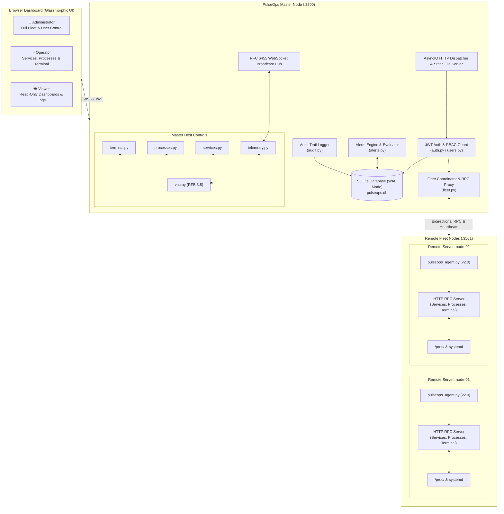

# ⚡ PulseOps Enterprise — Real-Time Linux Infrastructure Management

<div align="center">

<p align="center">
  
</p>

[](https://www.python.org/)
[](https://fastapi.tiangolo.com/)
[](https://jwt.io/)
[](https://kernel.org/)
[](LICENSE)
[](mailto:f2pnajmul@gmail.com)

<p align="center">
  <strong>An enterprise-grade, real-time Linux fleet monitoring dashboard, remote systemd operations center, process manager, and web terminal platform.</strong>
</p>

<p align="center">
  Engineered with high-performance asynchronous Python, an optional ASGI runtime, multi-node agent RPC telemetry, 3-tier RBAC security, and an ultra-responsive dark glassmorphic dashboard with zero frontend build dependencies.
</p>

</div>

---

## 📑 Table of Contents

- [🌟 Highlights & Key Features](#-highlights--key-features)
- [🏛️ System Architecture](#️-system-architecture)
- [👥 Role-Based Access Control (RBAC)](#-role-based-access-control-rbac)
- [🚀 Quick Start Guide](#-quick-start-guide)
  - [1. Running the Master Server](#1-running-the-master-server)
  - [2. Default Login Credentials](#2-default-login-credentials)
  - [3. Running as a Persistent Systemd Service](#3-running-as-a-persistent-systemd-service)
- [🌐 Multi-Node Fleet Management](#-multi-node-fleet-management)
  - [Auto-Agent Installation (One-Liner)](#auto-agent-installation-one-liner)
  - [Remote Agent Upgrades](#remote-agent-upgrades)
  - [Manual Agent Registration](#manual-agent-registration)
  - [🔬 Agent Architecture & System Resource Footprint](#-agent-architecture--system-resource-footprint)
- [🎛️ Core Capabilities & Modules](#️-core-capabilities--modules)
  - [1. Real-Time Telemetry & Smooth Canvas Charts](#1-real-time-telemetry--smooth-canvas-charts)
  - [2. Multi-Node Fleet Operations](#2-multi-node-fleet-operations)
  - [3. Docker Container Manager](#3-docker-container-manager)
  - [4. Network Ports Explorer](#4-network-ports-explorer)
  - [5. Linux Firewall Manager](#5-linux-firewall-manager)
  - [6. Security Threat Intelligence & SSH Brute-Force Triage](#6-security-threat-intelligence--ssh-brute-force-triage)
  - [7. SSL / TLS Certificate Manager & Let's Encrypt Certbot](#7-ssl--tls-certificate-manager--lets-encrypt-certbot)
  - [8. Systemd Operations & Live Journalctl](#8-systemd-operations--live-journalctl)
  - [9. Process Explorer & Signal Management](#9-process-explorer--signal-management)
  - [10. Multi-Host Web Terminal & Runbooks](#10-multi-host-web-terminal--runbooks)
  - [11. Embedded HTML5 VNC / RFB Desktop (x11vnc Standard)](#11-embedded-html5-vnc--rfb-desktop-x11vnc-standard)
  - [12. Reverse Proxy Manager (Nginx / Caddy / Apache)](#12-reverse-proxy-manager-nginx--caddy--apache)
  - [13. Cron & Systemd Timers Manager](#13-cron--systemd-timers-manager)
  - [14. OS Patch & Update Center](#14-os-patch--update-center)
  - [15. Backup & Disaster Recovery Manager](#15-backup--disaster-recovery-manager)
  - [16. Alert Rules Engine & Notifications](#16-alert-rules-engine--notifications)
  - [17. Compliance Audit Log & System Settings](#17-compliance-audit-log--system-settings)
- [🔌 API Reference](#-api-reference)
- [⚙️ Configuration & Environment Variables](#️-configuration--environment-variables)
- [🛡️ Security & Hardening Guidelines](#️-security--hardening-guidelines)
- [📁 Project Structure](#-project-structure)
- [🤝 Contributing](#-contributing)
- [👨‍💻 Author & Maintainer](#-author--maintainer)
- [📄 License](#-license)

---

## 🌟 Highlights & Key Features

* 🚀 **Zero External Frontend Build Tools**: Built with pure vanilla HTML5, CSS3, and JavaScript—no Node.js, Webpack, Vite, or npm compilation pipelines required.
* ⚡ **Dual Backend Engine**:
  * **Standalone AsyncIO Engine** (`server.py`): Zero external framework dependencies. Native non-blocking HTTP 1.1 + RFC 6455 WebSocket streaming.
  * **FastAPI + Uvicorn Runtime** (`fastapi_app.py`): Full ASGI integration with interactive Swagger UI (`/docs`) and ReDoc.
* 🛰️ **Distributed Multi-Node Fleet Management**: Seamlessly monitor dozens of remote Linux servers from a single master dashboard with dedicated telemetry, service management, process control, and terminal access per node.
* 🔒 **Enterprise RBAC & Security**:
  * Strict 3-tier Role-Based Access Control: **Admin**, **Operator**, and **Viewer**.
  * Cryptographic JWT access & refresh tokens with auto-renewal and server-side blacklisting on logout.
  * Two-Factor Authentication (TOTP 2FA) compatible with Google Authenticator, Authy, and 1Password.
  * Brute-force rate limiting and automated account lockout protection.
* 📊 **Kernel `/proc` Telemetry**: Direct zero-overhead parsing of `/proc/stat`, `/proc/meminfo`, `/proc/net/dev`, `/proc/uptime`, and `/proc/diskstats`.
* ⚙️ **Remote Systemd Management**: Inspect unit statuses, start/stop/restart/reload services, and tail live `journalctl` logs across master and agent nodes.
* ⚡ **Live Process Explorer**: Filter and inspect processes with real-time CPU/memory sorting and protected POSIX signal dispatching (`SIGTERM`, `SIGKILL`).
* 💻 **Browser-Based SSH/Web Terminal**: Execute shell commands, configure saved commands, and prompt for `sudo` elevation with destructive command safeguards.
* 🖥️ **Embedded HTML5 VNC / RFB Remote Desktop**: Integrated pure-Python RFB 3.8 protocol server and WebSocket-to-TCP RFB proxy for embedded graphical display control.
* 🚨 **Automated Alerting Engine**: Define threshold-based alert rules for CPU, RAM, Disk, and node offline events with instant UI bell notifications.

---

## 🏛️ System Architecture



---

## 👥 Role-Based Access Control (RBAC)

PulseOps enforces strict permissions across both the UI and backend REST API:

| Feature / Operation | 👑 Admin | ⚡ Operator | 👁️ Viewer | API Enforcement |
| :--- | :---: | :---: | :---: | :--- |
| **View Dashboards, Charts & Telemetry** | ✅ | ✅ | ✅ | Open / Read authenticated |
| **View Systemd Services & Journalctl Logs** | ✅ | ✅ | ✅ | `GET /api/services` |
| **View Process Explorer List** | ✅ | ✅ | ✅ | `GET /api/processes` |
| **View Active Alerts & History** | ✅ | ✅ | ✅ | `GET /api/alerts/*` |
| **Systemd Service Control (Start/Stop/Restart)** | ✅ | ✅ | ❌ | `POST /api/services/action` (403 for Viewers) |
| **Terminate Processes (SIGTERM / SIGKILL)** | ✅ | ✅ | ❌ | `POST /api/processes/kill` (403 for Viewers) |
| **Web Terminal Command Execution** | ✅ | ✅ | ❌ | `POST /api/terminal/exec` (403 for Viewers) |
| **Launch Remote VNC Desktop Sessions** | ✅ | ✅ | ❌ | `POST /api/vnc/launch` (403 for Viewers) |
| **Host Quick Actions (Reboot, Free RAM)** | ✅ | ✅ | ❌ | `POST /api/terminal/exec` (403 for Viewers) |
| **Register & Auto-Install Fleet Servers** | ✅ | ❌ | ❌ | `POST /api/fleet/servers` (Admin only) |
| **Edit Server Metadata & Tags** | ✅ | ❌ | ❌ | `PUT /api/fleet/servers/{id}` (Admin only) |
| **Remove Server from Fleet** | ✅ | ❌ | ❌ | `DELETE /api/fleet/servers/{id}` (Admin only) |
| **User Account Management (Create/Edit/Lock)** | ✅ | ❌ | ❌ | `/api/admin/users/*` (Admin only) |
| **Alert Rules Configuration** | ✅ | ❌ | ❌ | `POST/DELETE /api/alerts/rules` (Admin only) |
| **Audit Logs Inspection** | ✅ | ❌ | ❌ | `GET /api/admin/audit` (Admin only) |
| **System Settings Configuration** | ✅ | ❌ | ❌ | `PUT /api/admin/settings` (Admin only) |

---

## 🚀 Quick Start Guide

### 1. Running the Master Server

PulseOps can run immediately using Python 3.10+ without compiling anything:

```bash
# 1. Clone the repository
git clone https://github.com/Sword360/pulseops-Python-Based.git
cd pulseops-Python-Based

# 2. (Recommended) Create and activate a virtual environment
python3 -m venv venv
source venv/bin/activate

# 3. Install dependencies
pip install -r requirements.txt

# 4. Start the master server
python3 server.py
```

On startup, the server automatically initializes `pulseops.db` in SQLite WAL mode and binds to `0.0.0.0:3500`:

```text
⚡ PulseOps Enterprise Server running:
   ➜ Local:   http://localhost:3500
   ➜ Network: http://192.168.100.10:3500
```

---

### 2. Default Login Credentials

On first run, the database is seeded with a default administrator account:

* **URL**: `http://<MASTER_IP>:3500/login`
* **Email**: `admin@pulseops.local`
* **Password**: `Admin@Pulse123`

> [!IMPORTANT]
> Immediately change your password after initial login under **User Management** (`#users`) or via your profile dropdown menu.

---

### 3. Running as a Persistent Systemd Service

To ensure 24/7 uptime and automated reboot recovery on your master node:

1. Create the systemd unit file:
   ```bash
   sudo nano /etc/systemd/system/pulseops.service
   ```

2. Add the following unit configuration:
   ```ini
   [Unit]
   Description=PulseOps Linux Server Telemetry & Operations Dashboard
   After=network.target

   [Service]
   Type=simple
   User=root
   WorkingDirectory=/root/Project/pulseops-Python-Based
   ExecStart=/usr/bin/python3 /root/Project/pulseops-Python-Based/server.py
   Restart=always
   RestartSec=5
   Environment=PORT=3500
   Environment=HOST=0.0.0.0

   [Install]
   WantedBy=multi-user.target
   ```

3. Enable and start the service:
   ```bash
   sudo systemctl daemon-reload
   sudo systemctl enable --now pulseops.service
   sudo systemctl status pulseops.service
   ```

---

## 🌐 Multi-Node Fleet Management

PulseOps enables centralized multi-server management through lightweight agent nodes (`pulseops-agent`).

### Auto-Agent Installation (One-Liner)

1. Open the PulseOps web dashboard as an Administrator.
2. Navigate to **Fleet Overview** and click **`+ Add Server`** (or select **Agent Auto-Install**).
3. Copy the generated one-line command and execute it on the target remote server as root:

```bash
curl -sSL http://<MASTER_IP>:3500/api/fleet/agent-install.sh | sudo bash
```

The installer automatically:
- Detects the package manager (`apt-get`, `dnf`, `yum`, `pacman`).
- Installs Python 3 and creates an isolated virtual environment (`/opt/pulseops-agent/venv`) handling PEP 668 restrictions.
- Installs the v2 RPC agent daemon.
- Configures and starts `pulseops-agent.service` pointing to the master node.

### Remote Agent Upgrades

If a remote node is running an older agent version, upgrade it instantly to unlock remote systemd and process management:

```bash
curl -sSL http://<MASTER_IP>:3500/api/fleet/agent-update.sh | sudo bash
```

### Manual Agent Registration

For air-gapped or pre-provisioned environments:
1. Generate an invite token in **Fleet** > **Manual Registration**.
2. Run `pulseops_agent.py` on the target machine:
   ```bash
   python3 pulseops_agent.py --master http://<MASTER_IP>:3500 --token <INVITE_TOKEN> --port 3501
   ```

### 🔬 Agent Architecture & System Resource Footprint

The PulseOps Agent (`pulseops_agent.py`) is engineered under a strict **Zero-Impact Observability** mandate. It operates as a self-contained, micro-footprint daemon designed to monitor mission-critical production infrastructure without competing for compute, memory, or I/O bandwidth with primary applications.

#### Production Resource Profile (Benchmarks)

| Dimension | Typical Footprint | Peak / Burst | Architectural Rationale |
| :--- | :--- | :--- | :--- |
| **Resident Memory (RSS)** | **18 MB – 28 MB** | **~35 MB** | Pure Python runtime allocation. No JVM overhead, no V8/Node.js garbage-collection spikes, no Electron runtime. |
| **Virtual Memory (VIRT)** | ~45 MB – 75 MB | ~90 MB | Compact memory mapping of standard libraries and system interfaces. |
| **CPU Utilization** | **< 0.1% – 0.2%** | **~0.5% (1 core)** | Dormant 99.9% of time. Telemetry gathering executes in sub-millisecond bursts (< 2 ms) per interval. |
| **Storage / Disk Space** | **< 1.0 MB Total** | **< 2.0 MB** | Single-file script (`~45 KB`), configuration (`< 1 KB`), and systemd unit (`< 1 KB`) with compiled `.pyc` cache. |
| **Network Bandwidth** | **< 0.08 KB / sec** | **~2 – 4 KB / poll** | Compact JSON heartbeat (~650 bytes) transmitted every 15 seconds. High-rate polling occurs strictly on-demand when actively viewing that host. |
| **Disk I/O** | **0 bytes written** | Logged to journald | Stateless metrics collection. Never writes temporary caches, spool files, or metric buffers to client storage. |
| **Process Count** | **1 process** | 1 process | Single isolated systemd service daemon (`pulseops-agent.service`). |

#### Enterprise Architectural Advantages

1. **Direct Kernel Pseudo-Filesystem Telemetry (`/proc`)**:
   - Rather than spawning expensive subprocess forks (`top`, `ps`, `df`, `vmstat`, `netstat`), the agent reads directly from the Linux `/proc` filesystem:
     - `/proc/stat` & `/proc/loadavg` (Instantaneous CPU & load averages)
     - `/proc/meminfo` (Direct kernel memory page counts)
     - `/proc/net/dev` (Kernel network interface counters)
     - `os.statvfs()` (Native C-level filesystem stat calls)
   - Reading `/proc` bypasses user-space overhead and queries memory-mapped kernel counters directly in microseconds.

2. **Single-File Micro Daemon with Zero Framework Bloat**:
   - Zero external framework dependencies. Implemented exclusively with Python standard libraries (`http.server`, `urllib`, `socket`, `threading`, `json`).
   - Automatically utilizes `psutil` if present in the environment for accelerated native C extensions, with automatic fallback to native `/proc` parsers if unavailable.
   - Eliminates container or runtime dependencies—runs natively on any Linux kernel 2.6+ with Python 3.8+.

3. **Event-Driven Sleep Architecture**:
   - **Heartbeat Daemon Thread**: Sleeps for 15 seconds (`DEFAULT_HEARTBEAT_INTERVAL = 15`), wakes for ~1 ms to sample `/proc`, dispatches an HTTP POST heartbeat to the master, and immediately returns to kernel sleep.
   - **On-Demand RPC Telemetry Server (Port 3501)**: The built-in HTTP server remains in a non-polling socket wait state (`select`/`poll`), consuming **0.0% CPU** until an authorized operator issues a live inspection request from the master dashboard.

4. **Fault Tolerance & Zero-Leak Resilience**:
   - **Network Partition Immunity**: If the master node becomes unreachable or network routes degrade, the agent automatically applies a linear backoff retry loop without buffering metrics in memory, eliminating runaway memory exhaustion (leak-free design).
   - **Process Isolation**: Managed as a standard Linux service (`Type=simple`, `Restart=always`, `RestartSec=10`) with automated log rotation handled via systemd `journald`.
   - **Safe for Micro-Nodes**: Qualified to run safely on budget cloud instances with as little as 512 MB or 1 GB of RAM without noticeable impact on databases, web servers, or applications.

#### Industry Agent Comparison Benchmark

| Agent Solution | Runtime Engine | Typical RAM | Disk Footprint | Idle CPU | Dependency Footprint |
| :--- | :--- | :--- | :--- | :--- | :--- |
| **⚡ PulseOps Agent** | **Python stdlib** | **~25 MB** | **< 1 MB** | **< 0.2%** | **None (Standalone Python)** |
| **Prometheus Node Exporter** | Go Binary | ~20 – 35 MB | ~25 MB | < 0.5% | Go Static Binary |
| **New Relic Infrastructure** | Go / C Daemon | ~80 – 160 MB | ~150 MB | ~0.8 – 2.0% | Multi-binary Package + Plugins |
| **Datadog Agent (v7)** | Go Core + Python 3 | ~200 – 400 MB | ~650 MB+ | ~1.5 – 3.5% | Heavyweight Omnibus Package |
| **Telegraf (InfluxData)** | Go Binary | ~50 – 120 MB | ~100 MB | ~0.5 – 1.5% | Go Plugins + TOML engine |

---

## 🎛️ Core Capabilities & Modules

### 1. Real-Time Telemetry & Smooth Canvas Charts
* **Zero Overhead**: Direct `/proc` filesystem metrics parser (`CPU`, `Memory`, `Disk`, `Network RX/TX`, `Load Averages`).
* **Hardware Information**: Kernel version, architecture, CPU model, core topology, and active storage volume mounts.
* **Smooth Canvas Engine**: Custom HTML5 Canvas rendering engine with Bezier curve smoothing, dynamic Y-axis scaling, and dual network traffic visualization.

### 2. Multi-Node Fleet Operations
* **Central Hub**: Monitor dozens of Linux servers simultaneously with live status badges, latency, uptime, and aggregated health.
* **1-Click Installer**: Generate secure, time-limited invite tokens and deploy via a single `curl | bash` command.
* **Agent RPC**: Low-overhead HTTP/JSON RPC proxy connecting master dashboard directly to remote nodes.

### 3. Docker Container Manager
* **Container Lifecycle**: List, inspect, start, stop, restart, pause, unpause, and delete containers across master and agent nodes.
* **Live Container Logs**: Stream real-time container `stdout`/`stderr` logs with tail limits.
* **Deep Inspection**: Inspect container networking, port bindings, volume mounts, environment variables, and CMD configuration.

### 4. Network Ports Explorer
* **Active Sockets**: Real-time listing of listening TCP/UDP sockets with process name, PID, IP address, and protocol.
* **Public vs Local Triage**: Instantly identify exposed public ports versus localhost-only internal services.

### 5. Linux Firewall Manager
* **Dual Engine Support**: Native integration with both `ufw` (Debian/Ubuntu) and `firewalld` (RHEL/Rocky/CentOS).
* **Rule Administration**: Add and delete port/protocol access rules, inspect active zones, and trigger instant firewall reloads.

### 6. Security Threat Intelligence & SSH Brute-Force Triage
* **Auth Log Analysis**: Real-time parsing of `/var/log/auth.log` and `/var/log/secure` to identify brute-force attacks.
* **Attacker Profiling**: Track top attacking IPs, targeted usernames, hit counts, and geographic/network profiles.
* **Instant IP Banning**: 1-click firewall ban/unban actions with full compliance audit logging.

### 7. SSL / TLS Certificate Manager & Let's Encrypt Certbot
* **Host Certificate Scanner**: Automatically discover installed SSL certificates in `/etc/ssl`, `/etc/pki`, and Let's Encrypt paths.
* **Expiry Tracking**: Color-coded expiration progress bars (`Active`, `Expiring Soon`, `Expired`).
* **Endpoint Probe**: Test and inspect remote TLS handshakes, cipher suites, protocol versions (TLS 1.2 / 1.3), and SANs.
* **Certbot Integration**: Check Let's Encrypt `certbot` status and renew or issue certificates.

### 8. Systemd Operations & Live Journalctl
* **Unit Lifecycle**: Start, stop, restart, enable, or disable any loaded systemd unit on master or remote nodes.
* **Instant Triage**: View color-coded states (`active`, `inactive`, `failed`).
* **Live Logs**: Inspect the latest `journalctl` service logs directly in a modal console.

### 9. Process Explorer & Signal Management
* **Resource Sorting**: Live table sorting by CPU%, Memory% (RSS), and PID.
* **Signal Dispatch**: Send graceful `SIGTERM` (15) or immediate `SIGKILL` (9) signals with role confirmation safeguards.

### 10. Multi-Host Web Terminal & Runbooks
* **Target Node Switching**: Execute terminal commands directly on Master or transparently on any remote fleet node.
* **Sudo Elevation**: Prompts and handles elevated `sudo` commands securely without plaintext storage.
* **Interactive Runbooks**: Store, organize, and execute pre-approved maintenance scripts and troubleshooting commands.
* **Safety Filter**: Protects against accidental execution of destructive patterns (`rm -rf /`, `mkfs`, fork bombs).

### 11. Embedded HTML5 VNC / RFB Desktop (x11vnc Standard)
* **Standardized on `x11vnc`**: Provides a real screen mirror of the client desktop on standard RFB port `5900`.
* **Automated Agent Setup**: When the PulseOps agent is installed on any client machine, `x11vnc` is automatically installed, configured with smart display/Xauthority detection (`:0` or virtual fallback), enabled as a systemd service (`pulseops-x11vnc.service`), and permitted in UFW/firewalld.
* **Redesigned Dashboard Station**: TightVNC-style workstation interface in the PulseOps dashboard that seamlessly synchronizes with the active fleet node, displaying target hostname, IP, port 5900, 1-click TightVNC target copier, remote server lifecycle controls (Start/Restart/Stop x11vnc), and macro keys (Ctrl+Alt+Del, Alt+Tab, Super, Esc, Ctrl+C, Ctrl+V).
* **Dual Authentication Support**: Supports both instant 1-click unauthenticated access (`-nopw`) and standard RFB DES password authentication with an in-viewport unlock modal.
* **Native TightVNC Viewer Compatibility**: Connect directly through the web browser or point any standard desktop VNC client (TightVNC Viewer, RealVNC, TigerVNC) directly at `<CLIENT_IP>:5900`.

### 12. Reverse Proxy Manager (Nginx / Caddy / Apache)
* **Daemon Discovery**: Auto-detects installed reverse proxy engines (Nginx, Caddy, Apache) and displays real-time daemon status.
* **Virtual Host Management**: Inspects server configuration blocks and virtual hosts across configuration trees.
* **Safe Provisioning**: Automated configuration syntax validation (`nginx -t`) before applying updates to prevent accidental production downtime.
* **Zero-Downtime Reloads**: Reload proxy services gracefully and toggle virtual hosts active or disabled.
* **Access & Error Log Streaming**: Tail reverse proxy access and error logs with real-time HTTP response code analysis.

### 13. Cron & Systemd Timers Manager
* **Schedule Explorer**: Visual overview of system and user crontabs (`/etc/cron*`, `crontab -l`) and active systemd timers.
* **Human-Friendly Translation**: Real-time translation of 5-part cron syntax (e.g. `*/15 * * * *` → *"Every 15 minutes"*).
* **On-Demand Execution**: Run any scheduled task immediately with live output capture without altering schedules.
* **Execution Auditing**: Track run history, trigger sources, execution duration, and exit codes.

### 14. OS Patch & Update Center
* **Cross-Distribution Support**: Discovers upgradable packages across Debian/Ubuntu (`apt`), RHEL/Rocky/CentOS/Fedora (`dnf`/`yum`), and Arch (`pacman`).
* **Security CVE Advisories**: Automatically flags critical security updates and vulnerability patches.
* **Reboot Requirement Detection**: Detects pending system reboot flags (`/var/run/reboot-required`, `needs-restarting -r`).
* **Safe Patching Workflows**: Run simulated dry-run upgrades before applying live package updates, with detailed execution auditing.

### 15. Backup & Disaster Recovery Manager
* **Automated & Manual Snapshots**: Create complete or selective system configuration and database archives.
* **Archive Compression & Integrity**: Generates `.tar.gz` compressed archives with SHA-256 checksum verification.
* **Manifest Inspection**: Preview archive contents, file counts, and metadata before restoring.
* **Disaster Recovery**: 1-click restore workflows with verification checks and snapshot retention management.

### 16. Alert Rules Engine & Notifications
* Define automated rules for CPU%, Memory%, Disk%, and Agent heartbeats (`> 85% for 2 consecutive intervals`).
* Real-time notifications pop up in the top navigation bell with event severity tags (`WARNING`, `CRITICAL`).

### 17. Compliance Audit Log & System Settings
* **Audit Trail**: Every login attempt, terminal command, service modification, process kill, and fleet mutation is logged with timestamp, user ID, IP address, and status.
* **Central Settings**: Configure global retention limits, session timeout hours, SMTP alerts, and branding.
* **Database Maintenance**: 1-click SQLite VACUUM optimization, metric history purge, and automated database backup/restore.

---

## 🔌 API Reference

### Authentication & User Management
* `POST /api/auth/login` — Authenticate credentials with optional TOTP 2FA.
* `POST /api/auth/refresh` — Refresh access token using refresh token.
* `POST /api/auth/logout` — Invalidate session and blacklist token.
* `GET  /api/auth/me` — Fetch current user profile and role permissions.
* `GET  /api/admin/users` — List all registered users (Admin only).
* `POST /api/admin/users` — Create new user account (Admin only).
* `PUT  /api/admin/users/{id}` — Update user role, status, or password (Admin only).
* `DELETE /api/admin/users/{id}` — Delete user account (Admin only).

### Fleet Operations
* `GET    /api/fleet/servers` — List all monitored servers and current telemetry snapshots.
* `POST   /api/fleet/servers` — Manually register a new server node (Admin only).
* `PUT    /api/fleet/servers/{id}` — Update server display name, tags, and notes (Admin only).
* `DELETE /api/fleet/servers/{id}` — Remove a server from the fleet (Admin only).
* `GET    /api/fleet/servers/{id}/metrics` — Fetch historical telemetry timeseries.
* `POST   /api/fleet/register` — Agent registration endpoint using invite token.
* `POST   /api/fleet/heartbeat` — Periodic agent telemetry submission.
* `GET    /api/fleet/agent-install.sh` — Dynamic agent installer script.
* `GET    /api/fleet/agent-update.sh` — Dynamic agent updater script.

### System & Control Operations
* `GET  /api/services` — List systemd units (`?server_id=...`).
* `POST /api/services/action` — Start/stop/restart unit (`admin`, `operator`).
* `GET  /api/services/{name}/logs` — Fetch journalctl logs.
* `GET  /api/processes` — List running processes (`?server_id=...`).
* `POST /api/processes/kill` — Dispatch kill signal (`admin`, `operator`).
* `POST /api/terminal/exec` — Execute shell command on target node (`admin`, `operator`).
* `GET  /api/commands` — List saved commands and runbooks.
* `POST /api/commands` — Save a reusable command / runbook (`admin`, `operator`).

### Containers, Network, Security & SSL
* `GET  /api/docker/status` — Inspect Docker daemon availability (`?server_id=...`).
* `GET  /api/docker/containers` — List running/stopped containers.
* `POST /api/docker/action` — Container lifecycle action (start, stop, restart, pause, unpause, rm).
* `GET  /api/docker/logs` — Tail container standard output logs.
* `GET  /api/docker/inspect` — Detailed container configuration inspect.
* `GET  /api/network/ports` — List listening TCP/UDP ports and daemons.
* `GET  /api/firewall/status` — Get active firewall status and rules.
* `POST /api/firewall/rules/add` — Add a new firewall port rule (`admin`, `operator`).
* `POST /api/firewall/rules/delete` — Remove a firewall rule (`admin`, `operator`).
* `POST /api/firewall/reload` — Reload firewall rules.
* `GET  /api/security/threats` — Parse auth logs for failed SSH logins and attacker IPs.
* `POST /api/security/ban` — Block an attacking IP in the firewall (`admin`, `operator`).
* `POST /api/security/unban` — Unblock a banned IP (`admin`, `operator`).
* `GET  /api/ssl/certificates` — Discover installed host SSL/TLS certificates.
* `POST /api/ssl/probe` — Probe an external or local TLS endpoint for certificate details.
* `GET  /api/ssl/certbot` — Check certbot Let's Encrypt status.

### Reverse Proxy (Nginx / Caddy / Apache)
* `GET  /api/proxy/hosts` — List configured reverse proxy virtual hosts.
* `POST /api/proxy/hosts` — Provision a new proxy host (`admin`, `operator`).
* `POST /api/proxy/hosts/toggle` — Enable or disable a proxy host (`admin`, `operator`).
* `POST /api/proxy/hosts/delete` — Remove a proxy host configuration (`admin`, `operator`).
* `GET  /api/proxy/syntax` — Test proxy configuration syntax (`nginx -t`).
* `POST /api/proxy/reload` — Reload proxy service without downtime (`admin`, `operator`).
* `GET  /api/proxy/logs` — Stream reverse proxy access and error logs.

### Cron & Systemd Timers
* `GET  /api/cron/jobs` — List system and user crontab tasks.
* `POST /api/cron/jobs` — Create or schedule a new cron job (`admin`, `operator`).
* `POST /api/cron/jobs/toggle` — Enable or disable a cron job (`admin`, `operator`).
* `POST /api/cron/jobs/delete` — Delete a cron job (`admin`, `operator`).
* `POST /api/cron/jobs/run` — Manually trigger a cron job immediately (`admin`, `operator`).
* `GET  /api/cron/timers` — List active systemd timers.
* `POST /api/cron/timers/control` — Start, stop, or reload a systemd timer (`admin`, `operator`).
* `GET  /api/cron/history` — Query cron job execution history.

### OS Updates & Patching
* `GET  /api/updates/check` — Check for available package updates (`?refresh=1`).
* `GET  /api/updates/reboot-required` — Check if a system reboot is pending.
* `POST /api/updates/upgrade` — Execute system updates or dry-run simulation (`admin` only).
* `GET  /api/updates/history` — Retrieve past package upgrade logs.

### Backups & Disaster Recovery
* `GET    /api/backups` — List existing system backup archives.
* `POST   /api/backups/create` — Create a new backup snapshot (`admin` only).
* `GET    /api/backups/{id}/contents` — Inspect files contained within a backup archive.
* `GET    /api/backups/{id}/verify` — Verify SHA-256 archive integrity.
* `GET    /api/backups/{id}/download` — Download backup archive (`.tar.gz`).
* `DELETE /api/backups/{id}` — Delete a backup archive (`admin` only).

### Remote Desktop (VNC)
* `GET  /api/vnc/status` — Query VNC availability and active service status (`?server_id=...`).
* `POST /api/vnc/launch` — Launch / start x11vnc service on target node (`admin`, `operator`).
* `POST /api/vnc/stop` — Stop x11vnc service (`admin`, `operator`).
* `POST /api/vnc/install` — Install x11vnc and Xvfb packages (`admin`, `operator`).
* `WS   /api/vnc/ws` — Authenticated WebSocket RFB 3.8 proxy tunnel to target port 5900.

### Alerts & Administration
* `GET    /api/alerts/rules` — List active alert evaluation rules.
* `POST   /api/alerts/rules` — Create a new alert rule (Admin only).
* `DELETE /api/alerts/rules/{id}` — Delete an alert rule (Admin only).
* `GET    /api/alerts/active` — List currently firing alerts.
* `GET    /api/admin/audit` — Query audit log events with filter parameters (Admin only).
* `GET    /api/admin/settings` — Read system configuration settings (Admin only).
* `PUT    /api/admin/settings` — Update system configuration settings (Admin only).
* `POST   /api/admin/db/vacuum` — Optimize and vacuum SQLite database (Admin only).
* `POST   /api/admin/db/purge` — Purge expired metrics snapshots (Admin only).

---

## ⚙️ Configuration & Environment Variables

PulseOps can be configured via environment variables or the `.env` file:

| Variable | Default | Description |
| :--- | :--- | :--- |
| `PORT` | `3500` | Port for the HTTP and WebSocket server |
| `HOST` | `0.0.0.0` | Bind IP interface (`0.0.0.0` listens across all network interfaces) |
| `DB_PATH` | `./pulseops.db` | File path for the SQLite database |
| `SECRET_KEY` | *(Auto-generated)* | 256-bit cryptographic secret for signing JWT access tokens |
| `REFRESH_SECRET_KEY` | *(Auto-generated)* | Secret key for signing JWT refresh tokens |
| `SESSION_TIMEOUT_HOURS` | `24` | Default expiration window for user authentication sessions |

---

## 🛡️ Security & Hardening Guidelines

1. **Production Reverse Proxy & TLS**: Always terminate SSL/TLS via **Nginx**, **Caddy**, or an enterprise load balancer when exposing PulseOps outside a trusted LAN.
2. **Dedicated User Execution**: Run `server.py` under an unprivileged user (e.g. `pulseops`) and configure targeted `sudoers.d/pulseops` permissions for specific commands if complete root access is unnecessary.
3. **Firewall Isolation**: Restrict port `3500` and agent port `3501` to your management subnet or VPN (e.g. WireGuard, Tailscale):
   ```bash
   # firewalld (RHEL/Rocky/CentOS)
   sudo firewall-cmd --permanent --add-rich-rule='rule family="ipv4" source address="192.168.100.0/24" port port="3500" protocol="tcp" accept'
   sudo firewall-cmd --reload

   # ufw (Debian/Ubuntu)
   sudo ufw allow from 192.168.100.0/24 to any port 3500 proto tcp
   ```

---

## 📁 Project Structure

```text
pulseops-Python-Based/
├── server.py              # High-performance async HTTP & WebSocket server (master runtime)
├── fastapi_app.py         # Alternative ASGI FastAPI implementation with OpenAPI
├── pulseops_agent.py      # Remote agent daemon (telemetry, service & process RPC)
├── telemetry.py           # /proc filesystem metrics engine (CPU, RAM, Disk, Net)
├── services.py            # Systemd unit manager and journalctl log parser
├── processes.py           # Process explorer and POSIX signal dispatcher
├── terminal.py            # Safe Web terminal subprocess runner with sudo handling
├── vnc.py                 # Real VNC backend manager (x11vnc & TigerVNC) + RFB TCP proxy target
├── docker_manager.py      # Docker container inspection, logs, and lifecycle manager
├── ports_manager.py       # Network listening sockets and open ports explorer
├── firewall_manager.py    # Linux firewall manager (UFW & firewalld integration)
├── security_manager.py    # Threat intelligence & SSH brute-force auth log analyzer
├── ssl_manager.py         # SSL/TLS certificate scanner, endpoint probe & certbot manager
├── proxy_manager.py       # Reverse proxy manager (Nginx / Caddy / Apache) & log streamer
├── cron_manager.py        # Cron & systemd timers scheduler, translator & execution auditor
├── updates_manager.py     # OS package & security patch updates manager (apt, dnf, pacman)
├── backup_manager.py      # Enterprise backup snapshot creator, verifier (SHA256) & restore
├── commands_manager.py    # Reusable saved commands and interactive runbooks
├── maintenance_manager.py # Database optimization, vacuum, purge, and maintenance windows
├── fleet.py               # Multi-node server coordinator and remote RPC client
├── auth.py                # Enterprise JWT, bcrypt, TOTP 2FA, and RBAC authorization
├── users.py               # User authentication, credential storage, and profile management
├── database.py            # Async SQLite database layer with automated migrations
├── alerts.py              # Metric threshold rule evaluator and notification dispatcher
├── audit.py               # Immutable compliance audit trail logging system
├── requirements.txt       # Python dependencies (PyJWT, passlib, aiosqlite, cryptography)
├── REQUIREMENTS.md        # Technical specifications and runtime requirements
├── LICENSE                # Official open-source MIT License
├── README.md              # Comprehensive project documentation
└── public/                # Zero-build Glassmorphic Web Dashboard
    ├── index.html         # Main enterprise dashboard interface
    ├── login.html         # Glassmorphic login page with 2FA TOTP modal
    ├── css/
    │   ├── style.css      # Dark glassmorphism design system & RBAC visibility rules
    │   └── login.css      # Animated login page stylesheet
    └── js/
        ├── app.js         # Dashboard state management and real-time WebSocket client
        ├── auth.js        # Global JWT management, token auto-refresh, and auth guard
        ├── charts.js      # High-performance HTML5 Canvas performance charts
        ├── fleet.js       # Multi-node fleet grid, card actions, and server modals
        ├── docker.js      # Container manager cards, logs modal, and action dispatch
        ├── ports.js       # Listening sockets table and protocol filters
        ├── firewall.js    # Firewall status, rules table, and rule modal
        ├── security.js    # Threat intelligence dashboard, IP banning, and event stream
        ├── ssl.js         # SSL certificate cards, TLS probe, and certbot tools
        ├── proxy.js       # Reverse proxy hosts manager, syntax validator, and logs
        ├── cron.js        # Cron jobs & systemd timers visual schedule explorer
        ├── updates.js     # OS patch center, security CVE advisories, and live upgrades
        ├── backup.js      # Backup snapshots manager, archive inspector, and verifier
        ├── commands.js    # Runbooks, saved command executor, and create modal
        ├── services.js    # Systemd service manager and journalctl modal
        ├── processes.js   # Process explorer, filters, and termination controls
        ├── logs.js        # Live system log streamer and WebTerminal console
        ├── users.js       # User management, role badges, and password meter
        ├── alerts.js      # Alert rules engine modal and active notifications
        ├── audit.js       # Compliance audit activity log viewer
        ├── settings.js    # Enterprise system settings configuration
        └── vnc.js         # TightVNC-style HTML5 Canvas RFB 3.8 desktop workstation
```

---

## 🤝 Contributing

Contributions, feedback, and bug reports are welcome!

1. Fork the repository
2. Create your feature branch (`git checkout -b feature/AmazingFeature`)
3. Commit your changes (`git commit -m 'feat: Add AmazingFeature'`)
4. Push to the branch (`git push origin feature/AmazingFeature`)
5. Open a Pull Request

---

## 👨‍💻 Author & Maintainer

**PulseOps Enterprise** is proudly designed, architected, and maintained by:

* **Author**: **Najmul Islam**
* **Developer**: **Najmul Islam**
* **Email & Inquiries**: [f2pnajmul@gmail.com](mailto:f2pnajmul@gmail.com)

---

## 📄 License

This project is licensed under the terms of the **MIT License**. See the [`LICENSE`](LICENSE) file for the full license text.

Copyright © 2026 **Najmul Islam**. All rights reserved.

<div align="center">
  <sub>Built with ⚡ and Python Asyncio. Engineered for Linux system administrators, DevOps engineers, and SREs.</sub>
</div>
